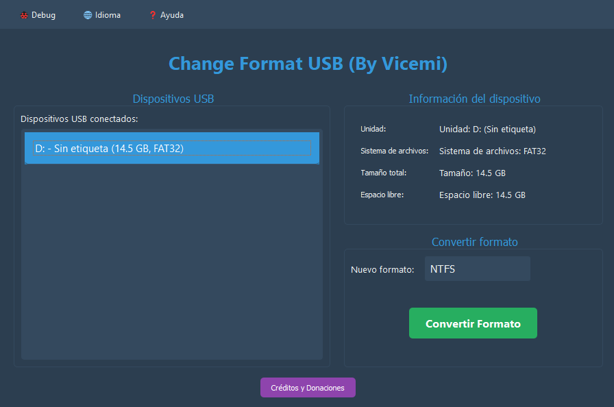

# ChangeFormatUsb

**ChangeFormatUsb** es una aplicación para Windows que permite cambiar el formato de tus unidades USB sin borrar los datos existentes. Su objetivo es facilitar la conversión de sistemas de archivos de forma segura, rápida y sencilla.

<div align="center">
    
</div>

---

## 🚀 Tabla de Contenidos

- [✨ Características](#-características)
- [🖥️ Requisitos](#️-requisitos)
- [⚙️ Instalación y compilación](#️-instalación-y-compilación)
- [📝 Uso](#-uso)
- [🤝 Contribuciones](#-contribuciones)
- [📄 Licencia](#-licencia)
- [👨‍💻 Créditos](#-créditos)
- [🖼️ Galería](#-galería)
- [📬 Contacto y web](#-contacto-y-web)

---

## ✨ Características

- Cambia el formato de unidades USB **sin pérdida de datos**.
- Interfaz gráfica intuitiva y moderna.
- Compatible con los principales sistemas de archivos: **FAT32, NTFS, exFAT** y más.
- Detección automática de dispositivos USB conectados.
- Proceso guiado paso a paso.
- Compatible con **Windows 10/11**.
- No requiere conocimientos avanzados.

---

## 🖥️ Requisitos

- Windows 10 o superior (64 bits recomendado).
- Python 3.8 o superior.
- [PyInstaller](https://pyinstaller.org/) para la compilación.
- Permisos de administrador para acceder a dispositivos USB.

---

## ⚙️ Instalación y compilación

1. Clona el repositorio:

        ```bash
        git clone https://github.com/vicemi/ChangeFormatUsb.git
        cd ChangeFormatUsb
        ```

2. Instala las dependencias:

        ```bash
        pip install -r requirements.txt
        ```

3. Compila el ejecutable con PyInstaller:

        ```bash
        pyinstaller changeformatusb.spec
        ```

        El ejecutable se generará en la carpeta `dist/`.

---

## 📝 Uso

1. Ejecuta el archivo generado en `dist/ChangeFormatUsb.exe`.
2. Selecciona la unidad USB que deseas formatear.
3. Elige el sistema de archivos de destino.
4. Haz clic en **Cambiar formato** y sigue las instrucciones en pantalla.

> **Nota:** Se recomienda realizar una copia de seguridad antes de cualquier operación de formato, aunque la aplicación está diseñada para no borrar datos.

---

## 🤝 Contribuciones

¡Las contribuciones son bienvenidas!

1. Haz un fork del repositorio.
2. Crea una rama con tu mejora o corrección:
        ```bash
        git checkout -b mi-mejora
        ```
3. Realiza tus cambios y haz commit:
        ```bash
        git commit -am "Agrega nueva funcionalidad"
        ```
4. Haz push a tu rama:
        ```bash
        git push origin mi-mejora
        ```
5. Abre un Pull Request.

Consulta el archivo [CONTRIBUTING.md](CONTRIBUTING.md) para más detalles.

---

## 📄 Licencia

Este proyecto está licenciado bajo la [Licencia Apache 2.0](LICENSE).

---

## 👨‍💻 Créditos

Desarrollado por [Vicemi](https://vicemi.dev).

---

## 📬 Contacto y web

- Sitio web: [https://vicemi.dev](https://vicemi.dev)
- Email: vicemi@vicemi.dev

¿Tienes dudas o sugerencias? ¡No dudes en abrir un issue o contactarme!

---
